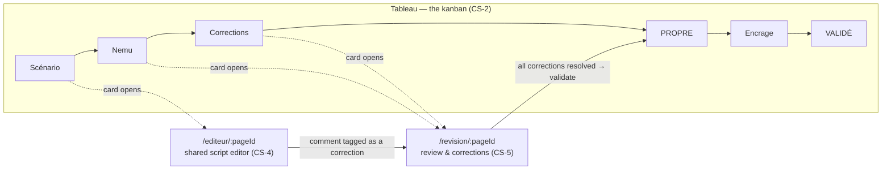

# The collaboration flow

How a team actually makes a page in Encre & Plume, as built today: the board that tracks it, the
editor they write it in, and the review where it gets corrected. Written against the code, not the
stories — every claim below points at a file.

Stories behind it: `CS-2` (workspace + board), `CS-3` (assets/versions), `CS-4` (shared editor),
`CS-5` (review & corrections), `CS-7` (chapters), `CS-8` (discussion), `CS-10` (group permissions),
`CS-15` (comment actions).

---

## 1 · The shape of it

A **project** (`/projet/[slug]`) is a workspace with six tabs — Tableau, Chapitres, Fichiers,
Discussion, Soutien, Infos (`ProjectWorkspace.tsx:20-36`). Almost everything below happens inside
the first one.

The unit of work is a **card** (`Page` in the schema, "Page 7" to a user). A card carries a stage, a
chapter, linked files, and its own comments and corrections. It moves left to right across six
columns, and two of those columns have a dedicated full-screen surface behind them: the **editor**
and the **review**.



The arrow from review back to the board is the only **automatic** stage change in the system. Every
other move is someone dragging a card.

---

## 2 · Who is allowed to do what

Collaboration rights live on the existing membership row (`WorkCreator`), not a new table
(`packages/shared/src/group.ts:1-3`). Two independent axes:

**Group role** — `leader` · `coleader` · `member`. Leadership implies every permission
(`effectiveGroupPermissions`, `group.ts:71-75`).

**Permission toggles** — three of them (`group.ts:14`):

| Permission | French label | Gates |
|---|---|---|
| `ecriture` | « Écriture » | Every write to project content: creating/moving/editing cards, labels, checklists, chapters, assets, the editor document. |
| `corrections` | « Corrections » | Filing a correction, changing its status, deleting it, and validating a review. |
| `fusion` | « Fusion » | **Declared but not yet enforced anywhere** — see §8. |

A new member gets `ecriture` + `corrections` by default (`group.ts:21`).

The write gate is one exported function, deliberately:

```ts
// apps/api/src/projects/members.service.ts:52
export function assertCanWrite(project, accountId): void {
  if (!hasGroupPermission(project, accountId, 'ecriture'))
    throw new ForbiddenException("Vous n'avez pas la permission « Écriture » sur ce projet.");
}
```

That comment block is worth reading (`members.service.ts:41-51`): the gate was wired per-route twice
and a sibling caller stayed open both times — the CS-4 gateway had it while the scenario REST routes
did not, then the asset routes did not either, so a member with the toggle off could still delete
the very asset the previous fix had protected. It is imported now, never re-derived. Same story for
`GROUP_GATE_SELECT` (`members.service.ts:26`): selecting that constant is what makes "the permission
columns were never loaded, so no gate was possible" unrepresentable.

Reading is separate and looser — membership alone. A recorded CS-10 decision says **leaving a comment
is not « Écriture »**, so card comments resolve through the read resolver on purpose
(`card-collab.service.ts:28-31`).

---

## 3 · The board (Tableau)

**Six columns**, fixed, in production order (`KanbanBoard.tsx:50-55`):

`Scénario → Nemu → Corrections → PROPRE → Encrage → VALIDÉ`

Backed by `PageStage` in the schema (`schema.prisma:1026-1033`). Corrections and VALIDÉ render as
accent columns; VALIDÉ is terminal and is what chapter progress counts as done.

**Every card belongs to a chapter.** `Page.chapterId` is non-nullable by design — there is no orphan
bucket, and the invariant is enforced by the column rather than by app code
(`schema.prisma:1039-1042`). Deleting a chapter that still holds cards is a `409`, never a cascade.
Within its chapter a card holds a dense `position` (`0..n-1`), rewritten as a whole permutation on
every move; displayed page numbers are *derived* from it, with a `double`-tagged card spanning two.

**Moving a card** is `PATCH /pages/:id/stage` — an ordinary « Écriture » write
(`pages.service.ts:274-280`). Drag & drop is native HTML5, no dependency, with optimistic updates
that revert on error; the card's `⋯` menu is the keyboard-accessible path for the same move
(`KanbanBoard.tsx:3-5`).

One side effect: moving a card **into** Corrections notifies every other member
(`project_activity`, best-effort — it never fails the request, `pages.service.ts:284-300`).

**What a card carries** (all `CS-2` card-modal, all cascade-deleted with the card):

| Piece | Model | Note |
|---|---|---|
| Labels | `ProjectLabel` + `PageLabel` | Project-scoped, colour from a fixed on-brand palette; the server rejects anything else with a 400 « Couleur invalide » (`shared/projects.ts:144`). |
| Checklist | `PageChecklistItem` | Ordered, shows as `x/y` on the card face. |
| Comments | `PageComment` | `@name` mentions raise a `mention` notification. Editable and deletable by their author. |
| Assignees | `PageAssignee` | Avatar stack on the card. |
| Files | `AssetPageLink` | Many-to-many since 2026-07-14 (see §6). |
| Due date | `Page.dueDate` | Date-only, serialized `YYYY-MM-DD`. |

`Page.createdById` is nullable only because the column landed after the table existed. A `null`
there is treated as **leadership-only** at the gate, so a failed backfill fails closed
(`schema.prisma:1055-1058`).

---

## 4 · The shared editor (`/projet/[slug]/editeur/[pageId]`)

Real-time collaborative script writing on **Yjs CRDTs**, relayed over a socket.io namespace on the
API's own server — there is no `y-websocket` daemon and no Hocuspocus.

**The server holds no document.** Postgres is the shared memory
(`editor.gateway.ts:44-48`). CRDT and awareness payloads are opaque base64, relayed verbatim, never
decoded by the API.

```
client A ─┐                        ┌─ editor:update  (CRDT bytes, base64)
          ├─ socket.io /editor ────┤─ editor:awareness (cursors, selections, typing)
client B ─┘   room: editor:page:*  └─ editor:sync    (ydocState + pending updates on join)
                    │
                    ├─ Redis adapter → fans out across N API instances
                    └─ Postgres: ScenarioDocument.ydocState + ScenarioUpdate[] (append-only log)
```

**Persistence is two-layer** (`schema.prisma:1213-1240`). `ScenarioDocument` holds the merged
`ydocState` (binary Yjs) plus `contentJson`, a readable `PlancheDoc` projection that PUB-1 can
exploit. Between saves, live edits accumulate as append-only `ScenarioUpdate` rows, which each
autosave `PATCH` **compacts away in the same transaction**. A joiner reads the persisted state *and*
the pending update rows **after** joining, so nothing is missed, and also broadcasts a state-request
to any live peer.

Saving is **explicit** — « Enregistrer » / `Ctrl+S`, no autosave timer (`EditorClient.tsx:5,52`).
Snapshotting a version is a separate, deliberate act (`POST /pages/:id/document/versions`).

**Two documents schemes**, persisted per document and restored on reopen: `manga`
(case / description / dialogue) and `prose` (plain rich text) — `ScenarioDocument.template`.

**Comments are per case.** `ScenarioComment` is keyed by `documentId + caseNo`, with an *optional*
text anchor: ProseMirror positions (best-effort, they drift) plus a durable `quote` snippet that is
what the sidebar actually shows. All-null means a plain case-level comment
(`schema.prisma:1241-1258`). Only the author can delete one (`CS-15`), and the deletion broadcasts to
the room.

Two traps the code documents, both worth knowing before touching this:

- **Auth runs in socket.io connection middleware, not `handleConnection`.** Socket.IO does not await
  a lifecycle hook before dispatching that same socket's first message, and the client emits
  `editor:join` immediately on connect — the join could arrive before `accountId` was set and be
  silently dropped forever, with no client retry. Reproduced live as two contexts stuck at
  "1 en ligne". Middleware *is* awaited (`editor.gateway.ts:63-70`).
- **The room migrates.** A join names a `pageId`, but once the server materializes the scenario the
  room moves asset-side and the client re-joins on `materialized` — so two cards sharing one scenario
  collaborate in a single room (`editor-collab.ts:33-38`).

A Redis outage fails the handshake **closed** (`editor.gateway.ts:80`).

---

## 5 · The review (`/projet/[slug]/revision/[pageId]`)

Reachable from the card, the card modal, and the editor header. It renders the reviewed **drawing**, the
annotations on it, and a correction list that unifies **both** kinds.

One thing to be clear about: since the CS-5 r4 pass the review page is **dessin-only**
(`ReviewClient.tsx:238-240`). The file picker lists drawing files, and the surface renders only when one is
selected — a scenario-only card shows the empty state. Scenario corrections are filed from the **editor**,
as tagged comments (below); the review screen lists them, but draws no scenario surface. The server-side
`surfaceOf` mapping still classifies both, because the payload does.

### One entity, two anchors

`Correction` is a single model with a **polymorphic anchor** (`schema.prisma:1274-1316`):

| Type | Anchor | Comes from |
|---|---|---|
| `dessin` | `{ region: { x, y, w, h } }`, normalized 0–1 | Dragging a box on the image |
| `scenario` | `{ documentId, from, to, quote }` | A CS-4 editor comment, tagged |

Both carry a required `description` ("what specifically"), an optional `caseRef`, an optional
assignee, and a status: **À corriger → En cours → Corrigé** (`a_corriger` / `en_cours` / `corrige`).

Server-side, a file's asset type decides its surface classification: `scenario`/`texte` → `scenario`,
`dessin`/`page` → `dessin` (`corrections.service.ts:443-451`). Only the `dessin` surface renders on the
review page today — see the note above.

### Drawing review

Numbered, status-coloured boxes drawn over the reviewed image (`DessinSurface.tsx`). The composer is
**always active** — a drag places a new region and the committed draft box stays movable, with a 2%
keyboard nudge. When a newer version exists you get side-by-side old ↔ new; there is deliberately
**no pixel diff**. Regions are stored normalized so they stay exact against a fitted image at any
viewport size — which is why the frame shrink-wraps the image rather than letterboxing it.

### Scenario review

A scenario correction **is** a tagged CS-4 comment, not a copy of one: `Correction.commentId` is a
1:1 link, and deleting the comment from the editor cascades the correction away
(`schema.prisma:1300-1303`). The anchor is the comment's own text range. Older rows predating this
keep `commentId = null`.

### Corrections are versioned

Every correction records `filedAgainstVersion` — the asset's head at the moment it was filed — and
gets `resolvedInVersion` stamped when someone marks it `corrigé`. Reopening it clears that stamp
(`corrections.service.ts:188-189`). So "this note was about v3, and v5 is what answered it" is a
fact in the data, not an inference from timestamps.

### Who can do what here

- Filing, status changes, deleting, validating: the « Corrections » permission
  (`assertCanCorrect`, `corrections.service.ts:437-441`).
- Changing a correction's **status**: additionally restricted to its author or its assignee
  (`corrections.service.ts:184-186`).

### Validating

`POST /pages/:id/review/validate` is the one automatic stage move (`corrections.service.ts:243-255`):

1. The card must be in **Corrections** — anything else is a `409` « La carte n'est pas en Corrections ».
2. **Zero** corrections may remain unresolved — otherwise `409` « Corrections non résolues » with the count.
3. The card moves to **PROPRE** and every other member is notified.

Already in PROPRE is an idempotent no-op, not an error.

---

## 6 · The spine underneath: files and versions

Everything above hangs off `CS-3` assets (`schema.prisma:1153-1211`).

- An `Asset` is a *logical* file with a **linear version chain** — `@@unique([assetId, version])`,
  no branching. `currentVersion` and `mediaId` denormalize the head.
- `AssetPageLink` is many-to-many: a `scenario`/`texte`/`ref` asset can be shared across many cards;
  a `dessin`/`page` asset keeps at most one link, and re-linking replaces it.
- `@@unique([projectId, filename])` is the re-import rule — same name means a new version, not a
  second file.
- The editor's working draft is 1:1 with a scenario asset (`ScenarioDocument.assetId`), and autosave
  **never** touches the version chain. Snapshotting is explicit.

Bytes themselves live in S3-compatible storage, never Postgres or the app server (see
`CLAUDE.md` → Media/images).

---

## 7 · The team thread (Discussion tab)

There is **no parallel project message entity**. The Discussion tab *is* a
`Conversation { type: 'group', projectId }` — the seam MC-9 already reserved
(`project-chat.service.ts:22-38`). Validation, attachments, realtime fan-out, offline notifications
and pagination all delegate to `MessagesService` and are never re-derived.

`ProjectChatService` owns exactly three things: provisioning that one conversation on first access
(`@@unique([projectId])` makes "one thread per project" unrepresentable rather than app-enforced —
the loser of a race adopts the winner), keeping its participants **equal to** the project's member
set so a new co-author gains the history and a revoked one loses it, and the member gate.

Admin/maintainer oversight is deliberately **not** built here: a maintainer is a stranger to this
thread.

---

## 8 · What is not built yet

Verified by which stories have shipped (`.claude/pipeline/03-creation-studio/`) — CS-1, 2, 3, 4, 5,
6, 7, 8, 10, 12, 13, 15 are in. Missing from the flow above:

| Gap | Story |
|---|---|
| **« Fusion » is declared but never enforced.** `'fusion'` appears in `GROUP_PERMISSIONS` and gets a French label, and *no* gate anywhere reads it. The toggle is currently decorative. | `CS-19` version merge validation |
| No version *comparison* view for scenarios beyond the review's two-version pane | `CS-18` |
| No editor zoom | `CS-17` |
| No project delete | `CS-16` |
| No œuvre completion status, no call capacity auto-close | `CS-14`, `MC-14` |
| No publish scheduling / cadence | `CS-9` |
| Licensing & collaboration rights not modelled | `CS-11` |

The `fusion` gap is the one to know about: a leader can hand out a permission that does nothing.
Grep confirms a single hit repo-wide, the declaration itself.

---

## 9 · Cross-cutting rule that binds all of this

From `CLAUDE.md`, and it governs every membership change touching the flow above:

> **A membership change affects the FUTURE — it never rewrites the past.**

Concretely, here: revoking someone removes their access, but `WorkCreator` is **retired, never
deleted**; credits are per *contribution*, not per current membership; and under French law the
*droit de paternité* is inaliénable (CPI L121-1), so "remove a credit" does not exist as an
operation. A revoked member drops out of the project conversation and loses the write gate — their
cards, comments, corrections and authored versions stay exactly where they are.
